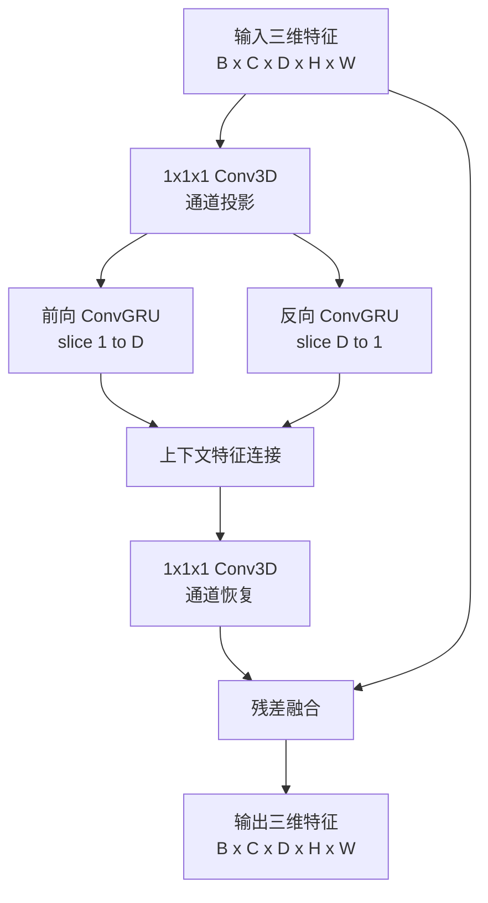
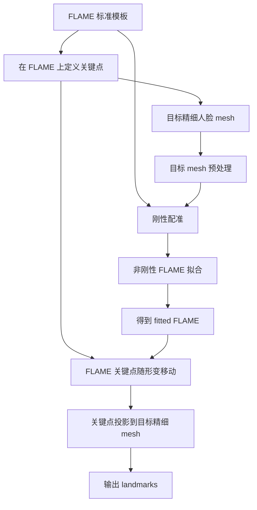

# 基于跨切片一致性建模的 X2CT-GAN 改进方法

**在 X2CT-GAN 中引入跨切片一致性建模，用于提升 X-ray 到 CT 三维重建结果的结构连续性。**

本工作的核心是从生成器的建模方式出发，在三维特征生成过程中显式建模 CT 切片之间的连续关系。

X2CT 任务的目标是根据二维 X-ray 图像重建三维 CT volume。CT volume 并不是一组彼此独立的二维图像，而是一组沿深度方向有序排列的切片：

相邻切片之间具有明显的解剖连续性。例如：

- 肺部边界在相邻切片之间应当平滑变化
- 骨结构不应在相邻切片中突然断裂
- 气道、血管等细长结构具有跨切片延续性
- 病灶区域通常会在多个连续切片中出现

原始 X2CT-GAN 虽然直接生成完整 3D volume，但对切片顺序和相邻切片关系的建模主要依赖 3D 卷积的隐式感受野，并没有专门强调切片连续性。

因此，本工作尝试能否在 X2CT-GAN 的生成器内部显式建模 CT 切片序列，从而提升生成 CT 的跨切片结构一致性？

---


## 1. 核心设计思想

### 1.1 从整体 3D 回归转向有序切片建模

原始 X2CT-GAN 更像是直接学习：

```text
F: X-ray → CT volume
```

本方法希望进一步显式建模：

```text
slice_i 与 slice_{i-1}, slice_{i+1} 之间的关系
```

也就是说，不只要求模型生成一个整体合理的 volume，还要求它在切片方向上具备连续的上下文传播能力。

### 1.2 在特征空间建模

目前选择在生成器的 3D 特征空间中进行跨切片建模，原因是：

- 特征空间包含更丰富的语义信息
- 模型可以在生成前主动修正结构连续性
- 不是简单后处理，而是生成过程的一部分
- 更符合“改进建模方法”的目标

---

## 2. 跨切片生成模块结构

模块结构对应流程图如下：



---

## 3. 模块细节设计

### 3.1 输入特征

模块输入为三维特征：

```text
X ∈ R^{B x C x D x H x W}
```

### 3.2 通道投影

为了降低序列建模的计算量，先使用 `1x1x1 Conv3D` 进行通道投影：

```text
X_proj = Conv3D_1x1x1(X)
```

其作用是：

- 降低 ConvGRU 的输入通道数
- 控制显存和计算开销
- 保留三维空间位置关系

### 3.3 2D ConvGRU 建模

对于每一个切片，使用 2D ConvGRU 递推建模。

普通 GRU 通常处理向量序列，而 CT 切片是二维空间特征图，因此这里使用 ConvGRU：

```text
h_i = ConvGRU(x_i, h_{i-1})
```

其中：

- `x_i` 是第 `i` 个切片特征
- `h_{i-1}` 是前一个切片传播过来的隐藏状态
- `h_i` 表示融合当前切片和前序上下文后的特征

ConvGRU 的优势是：

- 保留二维空间结构
- 能够建模相邻切片之间的连续变化
- 比 3D Transformer 更轻量
- 比纯 3D 卷积更强调顺序传播

### 3.4 双向切片建模

只使用正向建模时，第 `i` 个切片只能看到前面的切片：

但在 CT volume 中，一个切片的合理结构通常同时依赖前后切片。因此模块采用双向 ConvGRU：

```text
Forward:
slice_1 → slice_2 → ... → slice_D

Backward:
slice_D → slice_{D-1} → ... → slice_1
```

然后将两个方向的上下文特征进行拼接：

```text
H_i = concat(h_i_forward, h_i_backward)
```

这样每个切片都可以同时获得前后方向的结构信息。

### 3.5 通道恢复

双向 ConvGRU 输出后，使用 `1x1x1 Conv3D` 恢复到原始通道数：

```text
Delta_X = Conv3D_1x1x1(H)
```

这样输出可以与原始输入特征进行残差融合。

### 3.6 残差融合

最终输出采用残差形式：

```text
Y = X + gamma * Delta_X
```


## 4. 跨切片一致性损失函数

如果需要使用跨切片一致性 loss，通常形式可能是：

```text
L = || slice_i - slice_{i-1} ||
```

这种方式属于训练约束，主要在优化目标上惩罚不连续现象。而本方法目前是在模型结构中显式加入生成结构。


## 5. 在 X2CT-GAN 中的接入位置

本方法接入 multiview generator 的融合分支。

接入位置示意：


---

## 5. 总结

本工作针对 X2CT-GAN 中 CT 切片间连续性建模不足的问题，在生成器内部加入跨切片序列建模模块。

方法核心是：

将 3D feature volume 看作有序切片序列，
使用双向 ConvGRU 沿 depth 方向传播上下文，
再通过残差方式融合回原始三维特征。

相比单纯增加 loss，本方法直接改变了生成器的特征建模方式，使模型在生成 CT volume 时能够显式感知相邻切片之间的结构关系。

最终目标是让在三维空间中具有更强的解剖连续性和结构一致性。


# 基于 FLAME 配准的三维人脸关键点标定方案

## 1. 问题与解决方案

当前任务是：在三维建模的人脸模型上，标定一组具有明确语义的关键点位。

当前问题的核心是：在拓扑不一致的三维人脸 mesh 上，稳定地定义同一组语义关键点。

故需要建立一个统一的语义坐标系，使得同一组语义关键点在不同拓扑的三维人脸上表示相同。

为了解决这个问题，引入固定拓扑的人脸模板模型 `FLAME`。

---

## 2. 为什么选择 FLAME

FLAME 的全称是：

```text
Faces Learned with an Articulated Model and Expressions
```

FLAME 是一个参数化三维人脸模型，主要包含固定拓扑人脸模板

选择 FLAME 的原因：

- 拓扑固定，顶点编号具有稳定语义
- 能通过 shape / expression 参数拟合不同个体
- 可解释性强
- 已有较多拟合和重建代码可参考
- 适合用作关键点迁移的标准模板

在本任务中，FLAME 的作用不是替代原始精细 mesh，而是作为统一语义模板与配准中介

最终关键点仍然会投影回原始精细 mesh 表面。

---

## 3. 总体实现流程

整体流程如下：



可以概括为：

```text
FLAME 负责语义一致性
原始精细 mesh 负责最终几何精度
配准负责建立二者之间的对应关系
```

---

## 4.实现过程 

### 4.1 获取 FLAME 标准模板

首先从 FLAME 官方网站下载模型并生成中性表情、标准姿态的 FLAME 模板，并在模板上面标定关键点。

如果关键点刚好落在 FLAME 顶点上，可以保存顶点编号，如果关键点落在三角面内部，建议保存三角面和重心坐标。这种方式比单纯使用最近顶点更精确。

### 4.2 刚性配准

刚性配准用于解决 FLAME 与目标 mesh 之间的位置差异、朝向差异、尺度差异

刚性配准不改变 FLAME 脸型，只优化尺度、旋转矩阵、平移向量。

#### 为什么需要刚性配准

如果不先刚性配准，FLAME 和目标 mesh 可能处于完全不同的位置和尺度。

可能导致非刚性优化陷入错误解

因此刚性配准是非刚性配准的必要初始化步骤。

### 4.3 非刚性配准

非刚性配准的目标是：调整 FLAME 的 shape / expression / pose 参数，使其贴合目标个体人脸。

非刚性拟合可以写成：

```text
L = L_surface
+ λ_lmk * L_landmark
+ λ_shape * L_shape
+ λ_expr * L_expression
+ λ_pose * L_pose
```

各项含义：

- `L_surface`：FLAME 表面到目标 mesh 表面的距离
- `L_landmark`：FLAME 关键点到目标粗关键点的距离
- `L_shape`：限制 shape 参数不要过大
- `L_expression`：限制 expression 不要过度变化
- `L_pose`：限制姿态参数合理

### 4.4 关键点迁移与投影

当 FLAME 拟合完成后，FLAME 上的关键点会随着模板一起变形。

但由于 FLAME 的几何细节不如原始精细 mesh，最终点位不应停留在 fitted FLAME 上，而应该投影回原始目标 mesh。

---

## 5. 总结

本方案使用 FLAME 作为统一标准模板，通过刚性配准和非刚性配准建立 FLAME 与目标精细人脸 mesh 之间的对应关系，再将 FLAME 上定义好的关键点迁移并投影到目标 mesh 表面。

该方案的核心优势是：

- 能处理拓扑不一致的目标 mesh
- 点位语义统一
- 结果可解释
- 便于后续批量处理和质量控制
